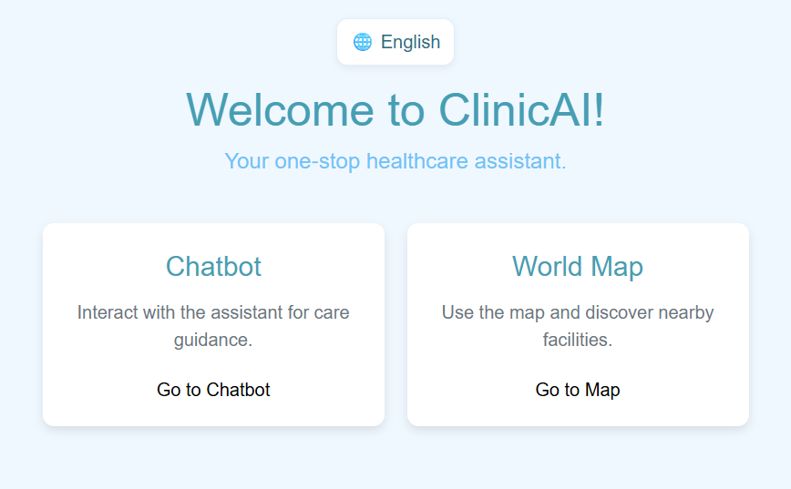
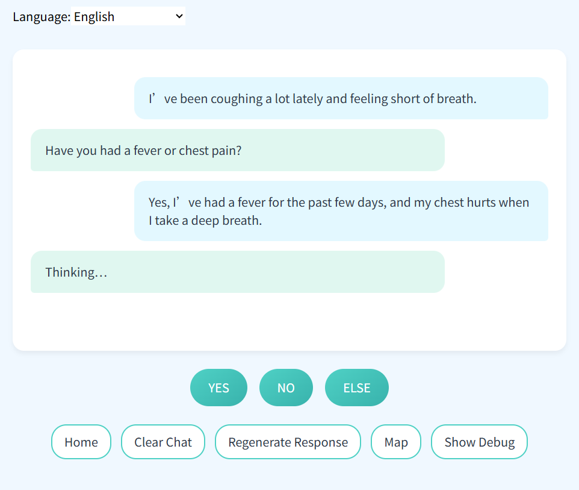
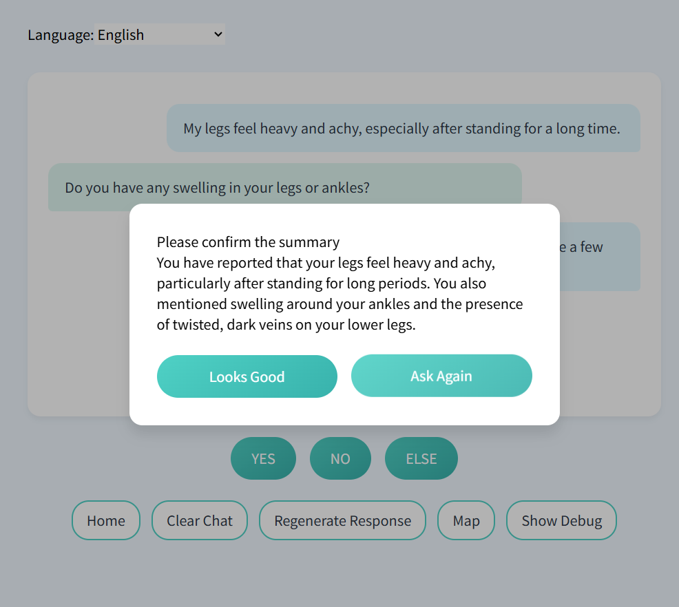
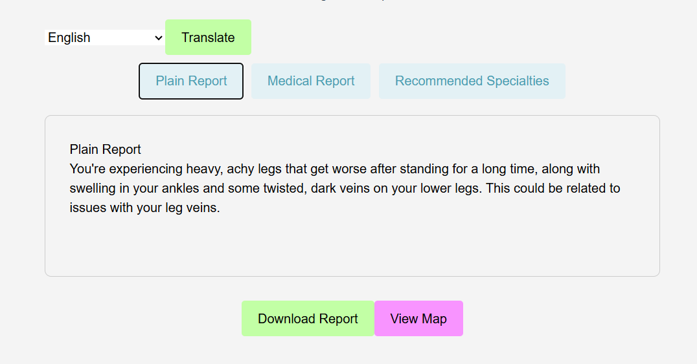
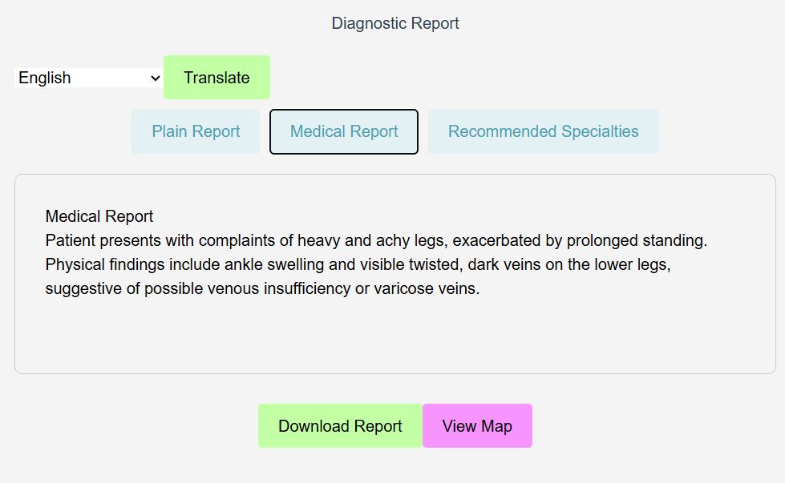
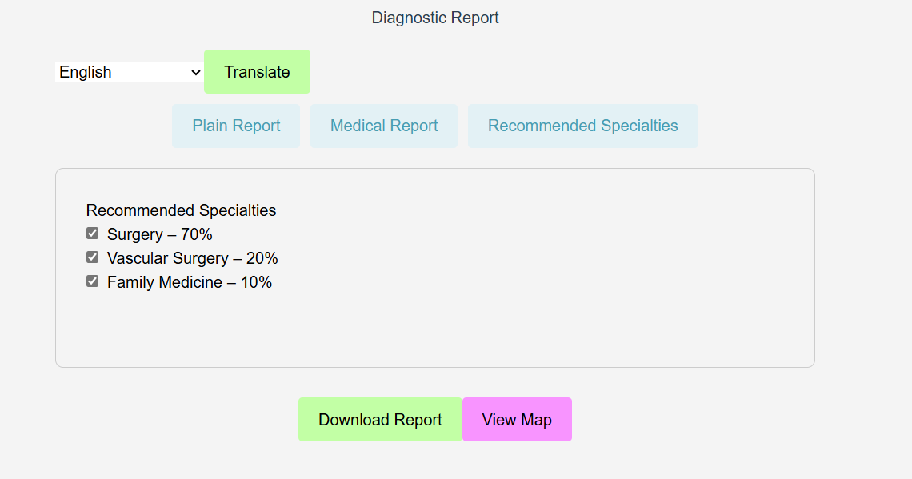
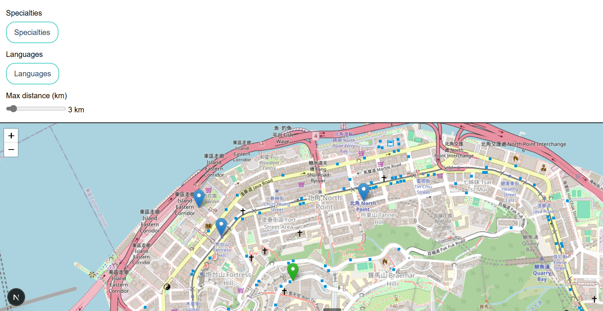

# ClinicAI

ClinicAI is a web-based assistant, originally prototyped with my team for an HKAGE course project.

It aims to reduce language and knowledge barriers in healthcare: newcomers from mainland China may worry about doctors’ Mandarin proficiency, Indonesian-speaking communities in Hong Kong struggle to find native-language clinics, and non-professionals often find it hard to describe symptoms effectively.

This prototype enables AI-assisted triage through conversation, estimates the likely specialty, generates multilingual summaries to improve doctor–patient communication, and helps users find nearby clinics on an interactive map.

The project includes a Next.js frontend and a minimal Flask backend API.

Languages: [English](README.md) | [简体中文](README.zh-CN.md) | [繁體中文](README.zh-TW.md)

## UX Guide · Pages & Flow

### Home ("/")
Purpose: entry hub to jump to the Chatbot and Map modules.


### Chatbot & Report ("/chatbot", "/report")
- Purpose: collect user symptoms through dialogue; after user approval, generate two summaries — a plain-language summary for users and a professional summary for clinicians — and recommend relevant specialties.
- Flow:
  1) The user provides information via quick buttons (YES/NO) or free text.
     
  2) When the backend AI considers the information sufficient, it asks the user to confirm whether the summary matches their situation; if approved, it proceeds to generate the report.
     
  3) After approval, the final report is generated and the app navigates to the Report page, which shows the plain and professional summaries and recommended specialties.
     
     
     

### Map ("/map")
- Purpose: visualize clinics; filter by specialty, language, and distance; switch between map and list views.
- Data:
  - Loads `public/clinic_data_i18n.json` (includes multilingual mappings for specialties and languages).
- Location:
  - Uses browser geolocation first; if unavailable, falls back to manual mode with a draggable green pin.
- Rendering:
  - Leaflet + OSM tiles + clustering; auto fits bounds for filtered results.
- Screenshot:
  

## Local Development

1. Install Node.js and Python
   - Node.js 18+ recommended.
   - Python 3.11, then install `flask`, `flask-cors`, `openai`:
     ```bash
     pip install flask flask-cors openai
     ```
2. Install Node dependencies
   ```bash
   npm install
   ```
3. Configure environment variables
   - `DEEPSEEK_API_KEY`: API key for the LLM backend
   - `NEXT_PUBLIC_BACKEND_URL`: Flask API URL, e.g. `http://localhost:5000`
4. Start the Flask API
   ```bash
   python app.py
   ```
5. Start the Next.js dev server (new terminal)
   ```bash
   npm run dev
   ```
6. Open `http://localhost:3000` in your browser.

## Running in VM or Container

1. Install Docker and Docker Compose.
2. Create a `.env` file and fill in the required environment variables.
3. Build and start with Docker Compose:
   ```bash
   docker-compose up --build
   ```
   The frontend will be served on port 3000 of the VM.

## Challenges
1. Due to LLM hallucinations and related issues, achieving precise diagnosis is difficult; the prototype’s diagnostic accuracy is limited.
2. Public datasets of doctor names, specialties, and languages generally prohibit scraping; we currently lack a clearly ethical way to source the required data.

## Notes

All API keys and logs have been removed from the repository. Provide your own credentials via environment variables for deployment.
