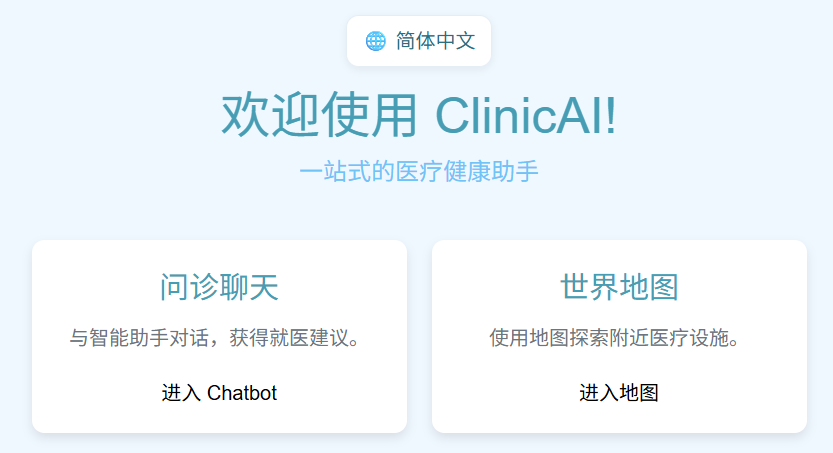
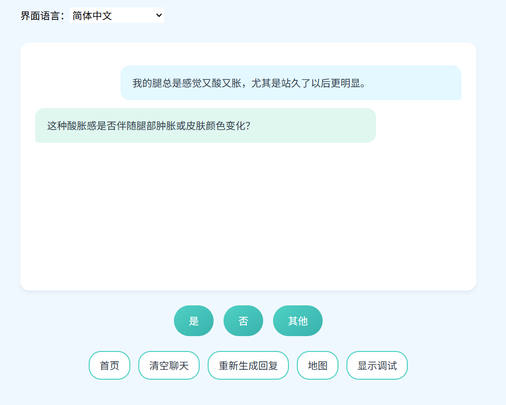
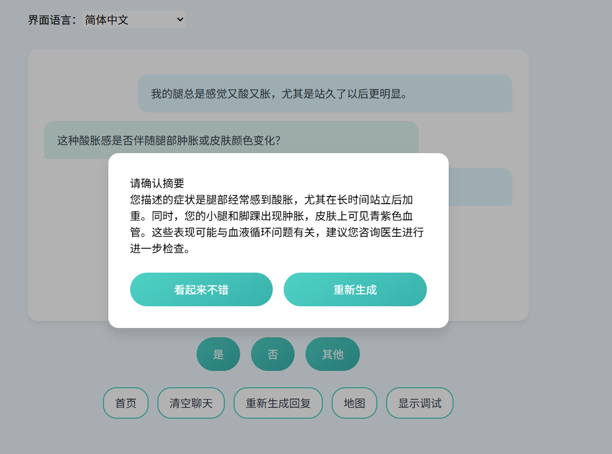
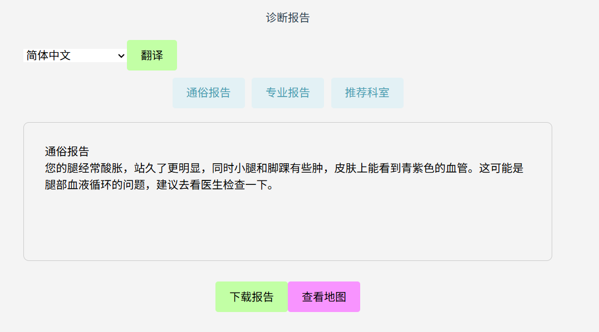
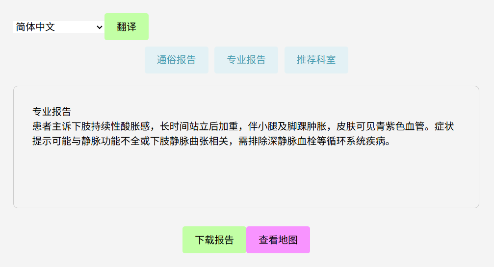
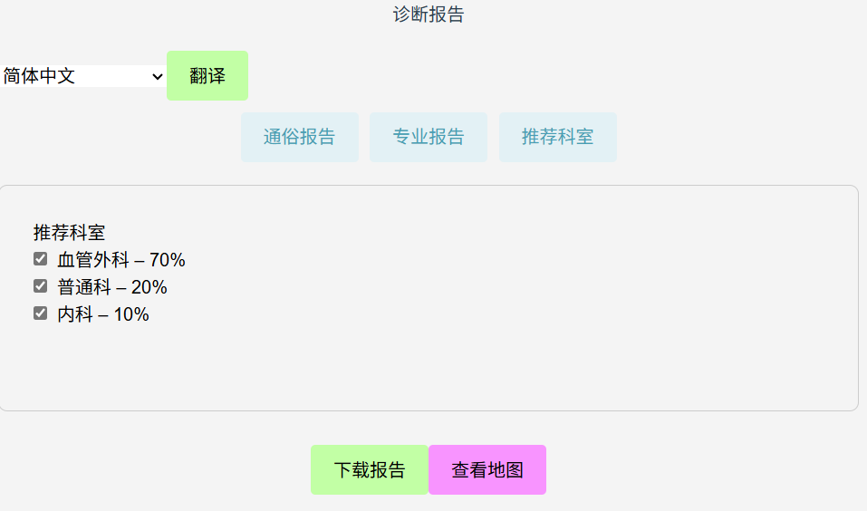
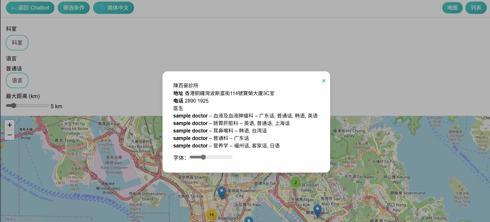

# ClinicAI

ClinicAI 是一款基于 Web 的智能助手，最初为 HKAGE 课程项目与团队共同开发的原型。

针对内地新移民就医可能面临的医生普通话不够流利、沟通效率不高，以及在港印尼语等群体难以快速找到母语诊所、非专业人士难以清晰表述症状等痛点，我们希望通过本原型降低医疗领域的语言与信息门槛：支持与 AI 对话完成初步问诊，辅助判定就诊科室，生成多语言医疗摘要以促进医患沟通，并通过交互式地图检索附近诊所。

项目由 Next.js 前端与精简的 Flask 后端 API 组成。

语言版本： [English](README.md) | [简体中文](README.zh-CN.md) | [繁體中文](README.zh-TW.md)

## UX 指南 · 页面与交互说明

### 首页（"/"）
用途：作为入口聚合页，跳转至 Chatbot 与 Map 两大模块。


### Chatbot 问诊页及病情报告页（"/chatbot", "/report"）
- 用途：通过对话收集用户症状；在用户批准后生成病情摘要，包括面向用户的通俗摘要与面向医生的专业摘要，并给出推荐科室。
- 流程：
  1) 用户使用快捷按钮（YES/NO）或文本输入提供病情信息；
     
  2) 当后端 AI 认为信息已充分时，询问用户摘要是否准确；用户同意后生成报告；
     
  3) 用户批准后生成最终报告并跳转到 Report 页面，包含通俗报告、专业报告与推荐科室。
     
     
     

### Map（"/map"）
- 用途：可视化展示诊所，按科室、语言、距离筛选；支持地图与列表视图切换。
- 数据：加载 `public/clinic_data_i18n.json`（包含科室与语言的多语映射）。
- 定位能力：优先使用浏览器定位；不可用时进入手动模式，可拖动绿色图钉设置位置。
- 地图渲染：Leaflet + OSM 瓦片 + 聚合；自动适配过滤后的边界。
- 界面示例：
  
  

## 本地运行

1. 安装 Node.js 与 Python
   - 建议 Node.js 18 或更高版本。
   - Python 3.11，并安装 `flask`、`flask-cors`、`openai`：
     ```bash
     pip install flask flask-cors openai
     ```
2. 安装前端依赖
   ```bash
   npm install
   ```
3. 配置环境变量
   - `DEEPSEEK_API_KEY`：语言模型后端的 API Key
   - `NEXT_PUBLIC_BACKEND_URL`：Flask API 地址，例如 `http://localhost:5000`
4. 启动 Flask API
   ```bash
   python app.py
   ```
5. 启动 Next.js 开发服务器（新开一个终端）
   ```bash
   npm run dev
   ```
6. 在浏览器访问 `http://localhost:3000`。

## 在虚拟机或容器中运行

1. 安装 Docker 与 Docker Compose。
2. 新建 `.env` 文件，填入必要环境变量。
3. 使用 Docker Compose 构建并启动：
   ```bash
   docker-compose up --build
   ```
   应用将通过 3000 端口对外提供前端服务。

## 挑战
1. 受 LLM 幻觉等因素影响，精确诊断具有难度，当前原型的诊断准确性仍有限。
2. 来自公开来源的医生姓名、科室与语言等数据普遍禁止爬取，目前缺乏明确且合乎伦理的数据获取途径。

## 说明

仓库已移除所有 API Key 与日志文件。请在部署时通过环境变量配置您的凭据。
