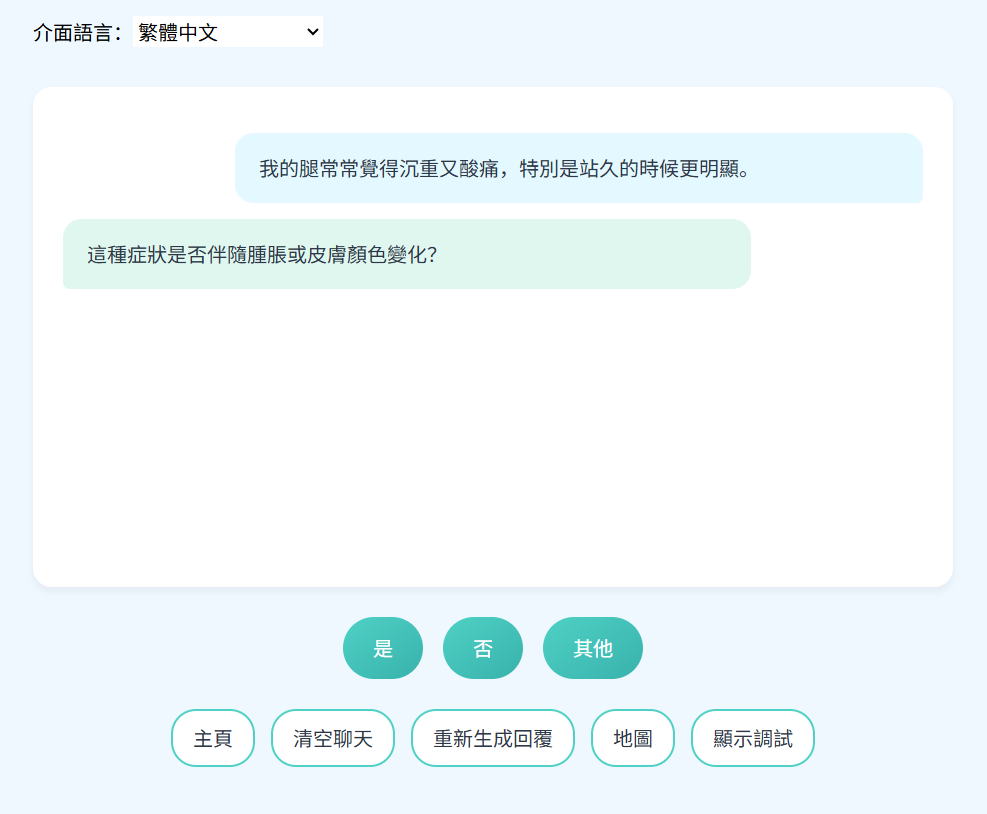
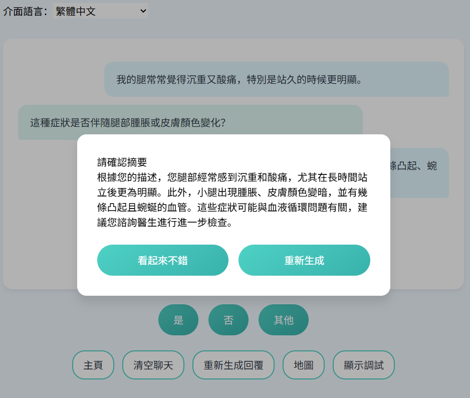
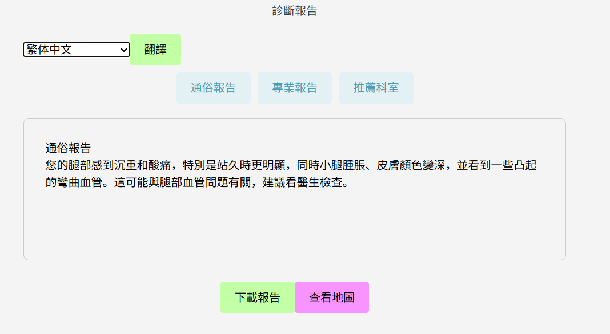
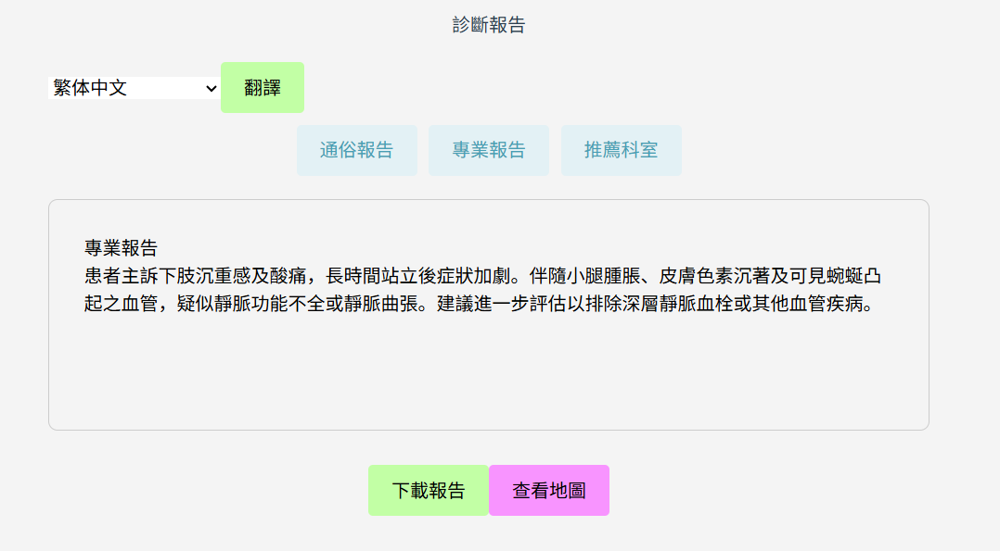
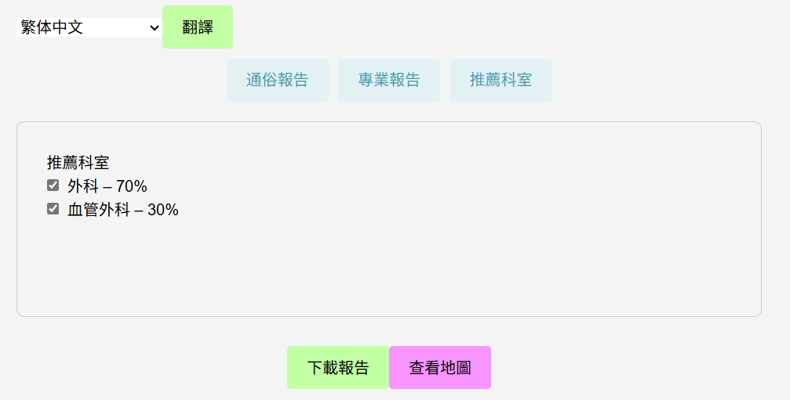
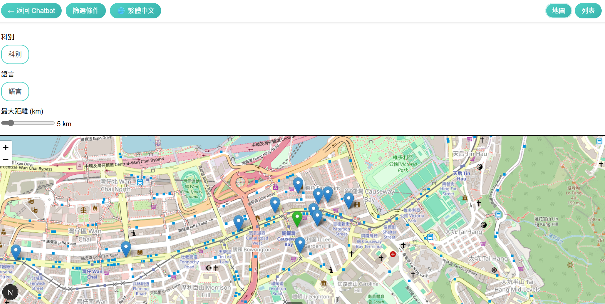
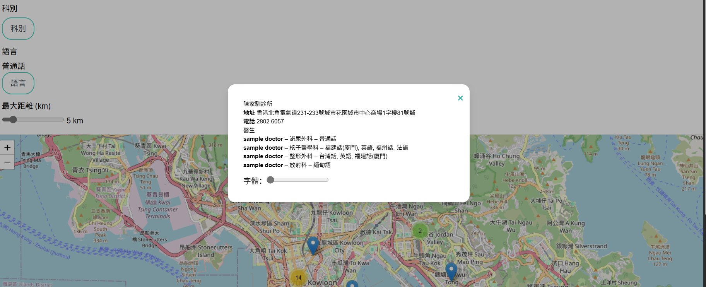

# ClinicAI

ClinicAI 是一款基於 Web 的智慧助理，最初為 HKAGE 課程專案與團隊共同開發之原型。

面對新移民就醫時可能遇到的醫師普通話不夠流利、溝通效率不佳，以及在港印尼語等族群不易迅速找到母語診所、非專業人士難以清楚陳述症狀等痛點，我們期望以本原型降低醫療領域的語言與資訊門檻：支援與 AI 對話完成初步問診、協助判定就醫科別、產生多語醫療摘要以促進醫病溝通，並透過互動式地圖檢索附近診所。

本專案由 Next.js 前端與精簡的 Flask 後端 API 組成。

語言版本： [English](README.md) | [簡體中文](README.zh-CN.md) | [繁體中文](README.zh-TW.md)

## UX 指南 · 頁面與互動說明

### 首頁（"/"）
用途：作為入口聚合頁，導向 Chatbot 與 Map 兩大模組。


### Chatbot 問診頁與病情報告頁（"/chatbot", "/report"）
- 用途：透過對話蒐集使用者症狀；在使用者同意後產生病情摘要，包含提供使用者閱讀的通俗摘要與提供醫師參考的專業摘要，並給出建議科別。
- 流程：
  1) 使用者透過快捷按鈕（YES/NO）或文字輸入提供病情資訊；
     
  2) 當後端 AI 研判資訊已充分時，將請使用者確認摘要是否準確；若同意，隨即產生報告；
     
  3) 使用者批准後生成最終報告並導向 Report 頁面，包含通俗報告、專業報告與推薦科別。
     
     
     

### Map（"/map"）
- 用途：視覺化展示診所，依科別、語言、距離進行篩選；支援地圖與列表檢視切換。
- 資料：載入 `public/clinic_data_i18n.json`（包含科別與語言之多語對應）。
- 定位能力：優先使用瀏覽器定位；若不可用，切換為手動模式，可拖曳綠色圖釘設定位置。
- 地圖渲染：Leaflet + OSM 圖磚 + 群集；自動調整至篩選後之邊界。
- 介面示例：
  
  

## 本機開發

1. 安裝 Node.js 與 Python
   - 建議 Node.js 18 以上版本。
   - Python 3.11，並安裝 `flask`、`flask-cors`、`openai`：
     ```bash
     pip install flask flask-cors openai
     ```
2. 安裝前端相依套件
   ```bash
   npm install
   ```
3. 設定環境變數
   - `DEEPSEEK_API_KEY`：語言模型後端之 API Key
   - `NEXT_PUBLIC_BACKEND_URL`：Flask API 位址，如 `http://localhost:5000`
4. 啟動 Flask API
   ```bash
   python app.py
   ```
5. 啟動 Next.js 開發伺服器（新開終端機）
   ```bash
   npm run dev
   ```
6. 以瀏覽器開啟 `http://localhost:3000`。

## 虛擬機或容器中執行

1. 安裝 Docker 與 Docker Compose。
2. 新增 `.env` 檔，填入必要環境變數。
3. 以 Docker Compose 建置並啟動：
   ```bash
   docker-compose up --build
   ```
   前端將透過 3000 連接埠對外提供服務。

## 挑戰
1. 受 LLM 幻覺等因素影響，實現精準診斷並不容易；本原型的診斷準確度有限。
2. 醫師姓名、科別與語言等公開資料通常禁止爬取；目前欠缺明確且合乎倫理的資料取得途徑。

## 致謝
本原型由我主導並開發。
感謝四位隊友於下列事項之貢獻：

- HKAGE 課程專案期間之 Pitch 撰寫與研究
- 測試功能，會話式 AI 模組之提示詞設計與優化

他們的合作使本專案得以實現。

## 說明

本倉庫已移除所有 API Key 與日誌檔；請於部署時透過環境變數配置您的憑證。
